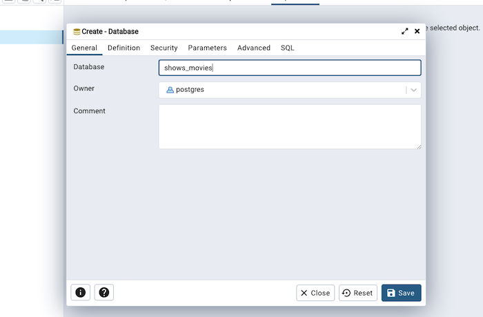
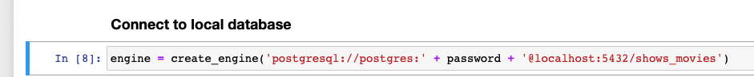
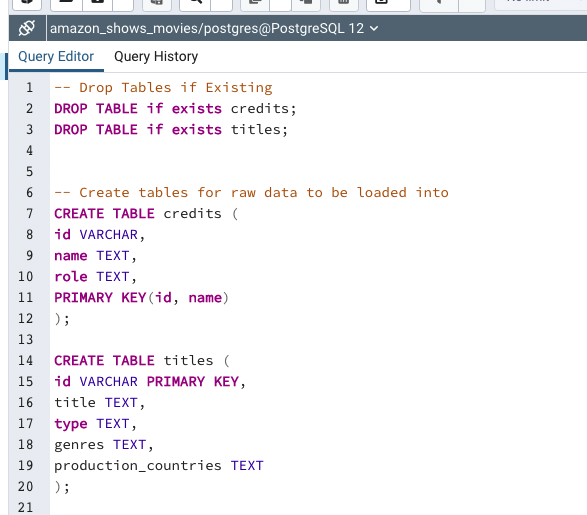
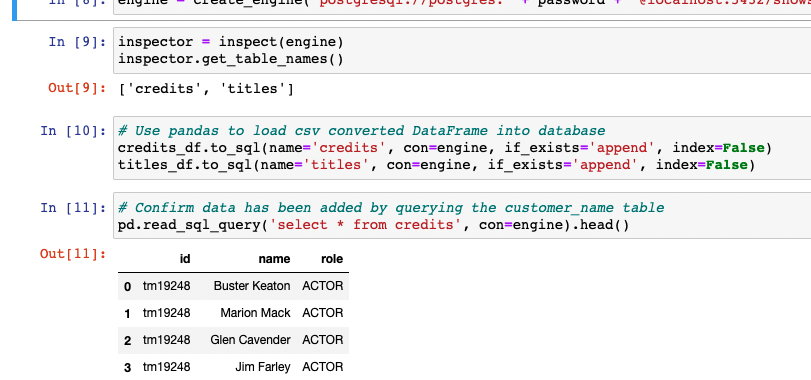

# ETL
### Group 7: Sally Mei, Amelia Horton, Lei (Jessie) Wan, Taylor Bohl

## Extract:
#### Our project is about Paramount TV shows and movies. Both datasets for our project are from [Kaggle](https://www.kaggle.com/datasets/victorsoeiro/paramount-tv-shows-and-movies). 

#### File 1: credits.csv (~40,000 rows) 
Columns: id, name, and role

#### File 2: titles.csv (~2,800 rows)
Columns: id, title, type, genres, and production_countries

## Transform:
To prepare the data to be loaded, we used Jupyter notebook to store each file in a pandas Data Frame. We then cleaned the data by removing duplicate rows and chose columns with the most relevant information to merge.  

## Load:
Using PGAdmin, a relational database, we joined the tables and queried the data. The tables are joined on column ‘id,’ which serves as a primary key for both tables. The ‘id’ column uniquely identifies each movie in the dataset. Our final joined table contains less null values than the original data because of the columns we selected.  

The joined table provides a comprehensive view on movies and tv shows along with their respective stars. We can query this table to determine which genres and types of media (movies vs. tv shows) each actor acts in the most. We could also determine how experienced an actor is based on how many productions they are in. Additionally, we could analyze the table based on production country which might provide some interesting trends on how this industry differs around the world. Below is a screenshot of the joined tables in PGAdmin.

#### Process for running our project
1.) Create a config.py file with your PGAdmin password.

2.) Open the jupyter notebook and run the cells up until cell 7. 

3.) When you reach 'Connect to local database' in the jupyter notebook, open PGAdmin and create a database called amazon_shows_movies.  Return to the jupyter notebook and run the 'engine' cell.

4.) Open the query tool and input the queries.sql text and run it. Return to the juptyer notebook and run the rest of the cells to confirm that the data was imported.

5.) Run any desired additional queries to analyze the data.

