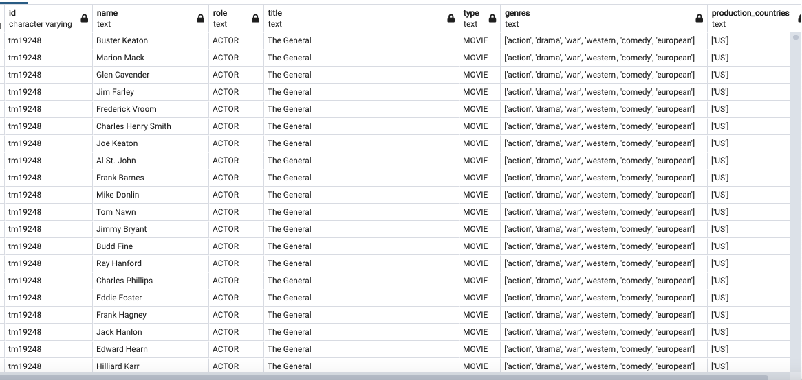

# ETL

Our project is about Paramount TV shows and movies. Both datasets for our project are from [Kaggle](https://www.kaggle.com/datasets/victorsoeiro/paramount-tv-shows-and-movies). 

### Group 7: Sally Mei, Amelia Horton, Lei (Jessie) Wan, Taylor Bohl

## File 1: credits.csv (~40,000 rows) 
Columns: id, name, and role

## File 2: titles.csv (~2,800 rows)
Columns: id, title, type, genres, and production_countries

## Process:
First we used jupyter noteobook and stored each file into a pandas Data Frame. We then cleaned the data by removing duplicate rows and chose columns with the most relevant information to merge.  Using PGAdmin, a relational database, we joined the tables and queried the data. The tables are joined on column ‘id,’ which serves as a primary key for both tables. The ‘id’ column uniquely identifies each movie in the dataset. Our final joined table contains less null values than the original data because of the columns we selected. We can query this table to determine which genres and types of media (movies vs. tv shows) each actor acts in the most. Below is a screenshot of the joined tables in PGAdmin.

